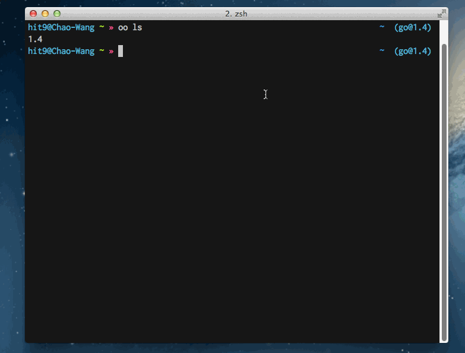

OO - Go Version Manager
------------------------

Latest version: 0.1.0

`oo` was heavily inspired by [tj/n](https://github.com/tj/n).



Requirements
------------

Supported system:

* Mac OSX
* Linux

Requirements:

* Bash
* Curl

Install
-------

1. Clone this repo.

   ```bash
   git clone https://github.com/hit9/oo.git $HOME/.oo
   ```

2. Add this to your bashrc or zshrc:

   ```bash
   source $HOME/.oo/env
   ```

   Or this if you are using fish shell:

   ```fish
   source $HOME/.oo/env.fish
   ```

Note that you still need to set `GOPATH` manually in your bashrc or zshrc,
oo doesn't take care of that:

```bash
export GOPATH=/path/to/your/gopath
export PATH=$PATH:$GOPATH/bin
```

Examples
---------

Get go1.12.6 installed:

```bash
$ oo get 1.12.6
```

Then, the `go1.12.6` is ready:

```bash
$ go version
go version go1.12.6 darwin/amd64
```

Use go1.12.6 as current `go` (or just `oo 1.12.6`):

```bash
$ oo use 1.12.6
=> go1.12.6
```

Run go from 1.12.6 temporary:

```bash
$ oo as 1.12.6 version
go version go1.12.6 darwin/amd64
$ oo as 1.12.6 run helloworld.go
Hello world!
```

List all installed go versions

```bash
$ oo ls
   1.12.5
=> 1.12.6
```

Build (or rebuild) go by version:

```bash
$ oo build 1.12.6
build go1.12.6..
build successfully
```

Get current go binary path:

```bash
$ oo bin
/Users/hit9/github/oo/go/bin/go
```

Remove a version:

```bash
$ oo rm 1.12.5                                                                                                                                                                          1 ↵ (go1.4 node@v2.0.0) ~/github/oo/versions/1.5/src
go@1.12.5 removed
```

You may need to [download a prebuilt golang](#using-prebuilt) on the first run,
if there's no golang installed, bootstrap won't work.

Using Prebuilt
--------------

By default, oo prefers to bootstrap a new version via an existing installed version:

```bash
$ oo get 1.12.6
get https://codeload.github.com/golang/go/tar.gz/go1.12.6..
######################################################################## 100.0%
using go1.12.5 to bootstrap go1.12.6....
build successfully
=> go1.12.6
```

But we are still able to download a prebuilt packages directly from https://golang.org/dl/
without a build waiting:

```bash
$ oo get 1.10.3 --use-prebuilt
get https://dl.google.com/go/go1.10.3.darwin-amd64.tar.gz..
######################################################################## 100.0%
=> go1.10.3
```

Usage
-----

```bash
Usage: oo [COMMAND]

Commands:
  oo                         Output current go version
  oo ls                      Output versions installed
  oo <version>               Use go <version>
  oo use <version>           Use go <version>
  oo get <version>           Get go <version>
  oo rm <version>            Remove the given version
  oo as <version>            Run go from oo on a specific version
  oo dir [<version>]         Show go directory by version
  oo bin [<version>]         Show go binary path by version
  oo build [<version>]       Build go by version
  oo env                     Output current go env
  oo upgrade                 Upgrade oo to latest version

Options:
  -v, --version              Output oo's version
  -h, --help                 Output this help message

Environment Variables:
  OO_MIRROR_PATTERN          Mirror url pattern to download go source tarball
                             default: https://codeload.github.com/golang/go/tar.gz/go%s
  OO_BUILD_CMD               Command to build go from source, default: ./make.bash
  OO_BOOTSTRAP_VERSION       Bootstrap go version to compile the target version,
                             default: the latest installed version

  PREBUILT_PKG_URL_PATTERN   Url pattern to download pre-built go package
                             default: https://dl.google.com/go/go%s.%s-amd64.tar.gz
                             The first parameter here is version, the second is platform.
                             Use https://dl.google.com/go/go%s.%s-arm64.tar.gz for arm64 platforms (e.g. Mac M1).
Version: 0.0.7
```

Custom Mirror
-------------

To use custom mirror url to download golang source:

```bash
$ export OO_MIRROR_PATTERN='https://storage.googleapis.com/golang/go%s.src.tar.gz'
$ oo get 1.12.6
get https://storage.googleapis.com/golang/go1.12.6.src.tar.gz..
##########                                                                14.4%
```

To use custom mirror url to download prebuilt golang package:

```bash
$ export PREBUILT_PKG_URL_PATTERN=https://dl.google.com/go/go%s.%s-arm64.tar.gz
$ oo get 1.16.3 --use-prebuilt
get https://dl.google.com/go/go1.16.3.darwin-arm64.tar.gz..
########################################################################################################################################################################################################################## 100.0%
=> go1.16.3
```

You can add these environment variables to your bashrc or zshrc etc. for convenience.

Similar Projects
----------------

- [tj/n - Node version management](https://github.com/tj/n)
- [qw3rtman/p - Python Version Management Made Simple](https://github.com/qw3rtman/p)

Troubles
--------

If there are any errors during the bootstrap building, it's helpful to build manually to check
what errors occurred:

```
cd path/to/oo/versions/x.x.x/src
GOROOT_BOOTSTRAP=path/to/downloaded/go ./all.bash
```

License
--------
MIT.
